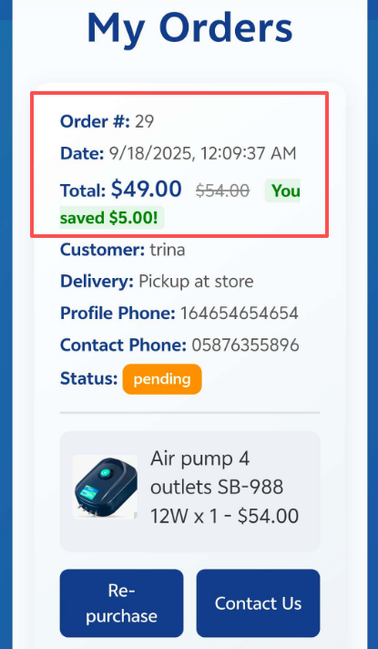

# LovelyFish Aquarium - Frontend

An online platform for buying aquarium equipment, built with React and Bootstrap. The frontend handles product browsing, shopping cart, checkout, and interactive user interface features.

---

## Live Site
[www.lovelyfishaquarium.co.nz](https://www.lovelyfishaquarium.co.nz)

## Repository
- [Front-end GitHub](https://github.com/trinazhang2024/LovelyFish)
- [Back-end GitHub]( https://github.com/TrinaJinfeng/LovelyFish.git)
---

## Features
- Product browsing with search and filtering
- Shopping cart and checkout functionality
- Interactive homepage carousel
- Interactive carousel and promotional modules enhance user engagement
- Fully responsive layout using Bootstrap grid for mobile, tablet, and desktop

---

## Tech Stack
- **Front-end:** React, Bootstrap, CSS, Axios
- **State Management:** React state and context
- **Routing:** React Router
- **Deployment:** Azure Static Web Apps

---

## Installation & Running Locally
**1. Clone the repository:** 
```bash
   git clone https://github.com/trinazhang2024/LovelyFish.git
```   
**2. Navigate to the project folder:**
```bash
   cd LovelyFish
```   
**3. Install dependencies:**
```bash
  npm install
```
**4. Start the development server:**
```bash
  npm start
```
**5. Open http://localhost:3000 to view the app in the browser.**

---

## API & Documentation
- Frontend communicates with the backend via RESTful APIs.

- Backend API documentation (Swagger): Swagger UI (available in backend repo).

---

## 🧪 Testing (Frontend)

### 1. Add to Cart Button
- **Issue found:** The “Add to Cart” button appeared on multiple pages with inconsistent styles and duplicated logic.  
- **Fix implemented:** Refactored into a reusable `AddToCartButton.jsx` component with consistent styling and behavior.  
- **Result:** Cleaner UI, unified user experience, and reduced repetitive code.  

### 2. Loading State
- **Issue found:** Product pages briefly flashed or appeared empty while data was being fetched.  
- **Fix implemented:** Added a loading state with a spinner/placeholder until product data fully loaded.  
- **Result:** Smoother page transitions and stable user experience.  

### 3. Cart Page Responsiveness
- **Issue found:** On desktop, tablet, and mobile testing, `CartPage.jsx` layout did not adapt well; product details were squeezed on smaller screens.  
- **Fix implemented:** Redesigned the layout into a card-based format for mobile view using Bootstrap grid and custom CSS.  
- **Result:** Improved readability and user experience across all screen sizes.  

### 4. Image Display Issue after Deployment
- **Issue found:** Locally images displayed correctly, but after deploying to Azure (with images in Blob storage), product images on Cart, Order Confirmation, and Orders pages failed to load.  
- **Investigation & Fix:** Backend was updated to return full image URLs; frontend directly uses these paths.  
- **Result:** All images display correctly across pages, ensuring consistent user experience.  

### 5. New Informational Modules
- **Issue found:** Initial design lacked guidance and informational content for aquarium buyers.  
- **Fix implemented:** Added “Fish Information Center” and “Fish Care Guidance” sections based on project lead and customer feedback.  
- **Result:** Increased user engagement and potential site traffic, providing additional value to visitors.  

### 6. Multi-Device Login Testing
- **Issue:** Backend session stored in cookies. On iPhone Safari (and some mobile browsers), API /account/me requests failed because cookies were blocked.
- **Frontend Investigation:** Tested cross-browser behavior, verified that desktop works but mobile Safari blocks the cookie.
- **Result:** Users can log in on desktop without issues. Mobile limitations noted and backend informed; future improvements could include token-based authentication (JWT) to ensure cross-device consistency.
- **Visual Evidence:**  
 **Desktop**  
✅ Login succeeds and user info returned    
 **iPhone Safari**  
❌ Login succeeds but fails to fetch user info


### 7. Cart Calculation
- **Issue:** Users expect instant updates of total price and quantities in the shopping cart.
- **Fix Implemented:**
Added frontend calculation logic to update subtotal and total dynamically for better UX.
Ensured that final payment amount is calculated and verified by backend when submitting the order.
- **Result:**
Frontend displays totals immediately ✅  
Backend calculation ensures correctness of payment ✅  
Users see instant feedback without compromising transaction accuracy.  
- **Visual Evidence:**  
**Frontend Calculation**  
 


**Backend Verification**  



---

## Highlights
- Full-stack project with frontend and backend integration

- Deployed on Azure for live access

- Focused on user-friendly interface and modern design

- Optimized layout and navigation for better UX

---

## Author
Trina Zhang
Email: zhang.trina@yahoo.co.nz
